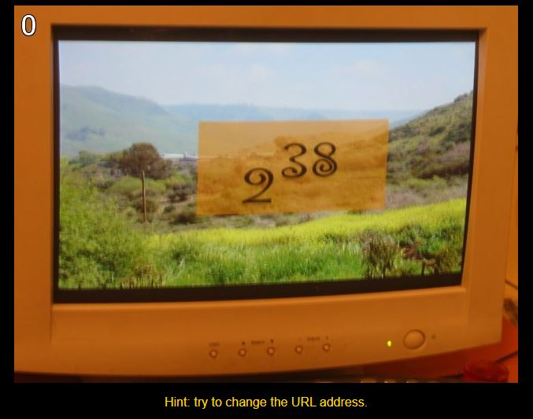

# First Python Challenge (Challenge #0)
Go to [the Python Challenge website](http://www.pythonchallenge.com/) and click the link that says *Click here to get challenged*. You should see this picture.   

   

You will write a *very* short Python program  using Python’s arithmetic operators to solve this first challenge. You may find [Computer Programming B slide presentation](https://docs.google.com/presentation/d/1bZI-LdwErEXQETAUeHeGOXOwrISVvKMGLxfJEabJ66U/edit?usp=sharing) helpful. If you get it correct, it will advance you to the next level. Submit the Python program you wrote to the google classroom assignment. 
